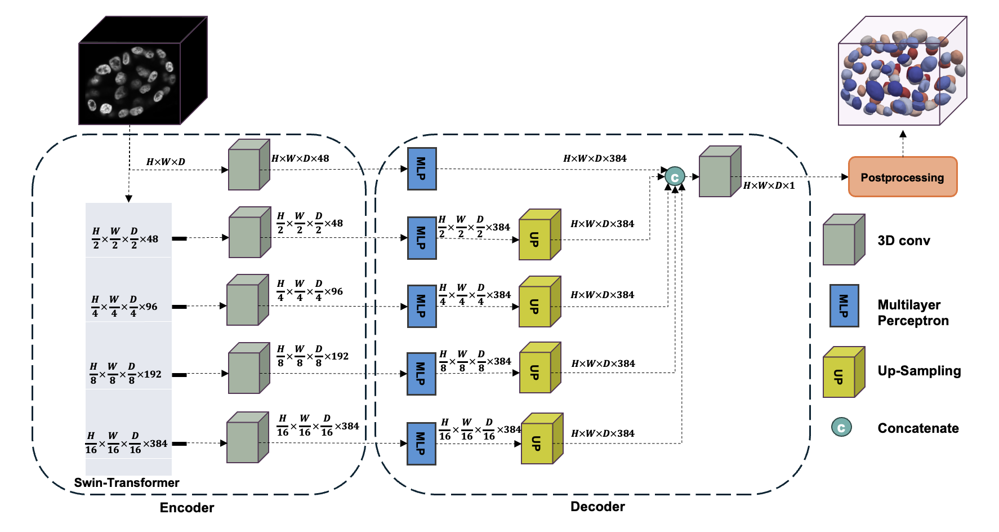
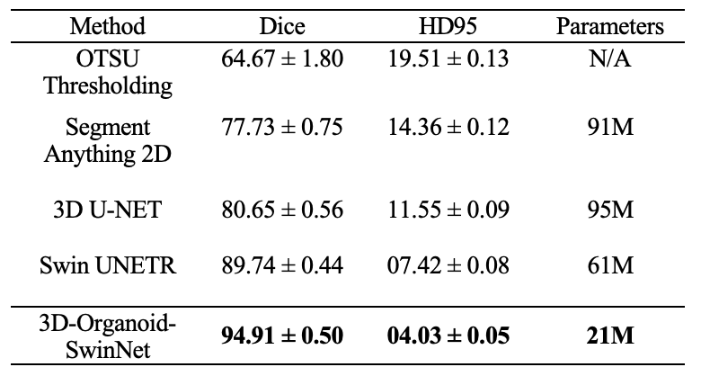
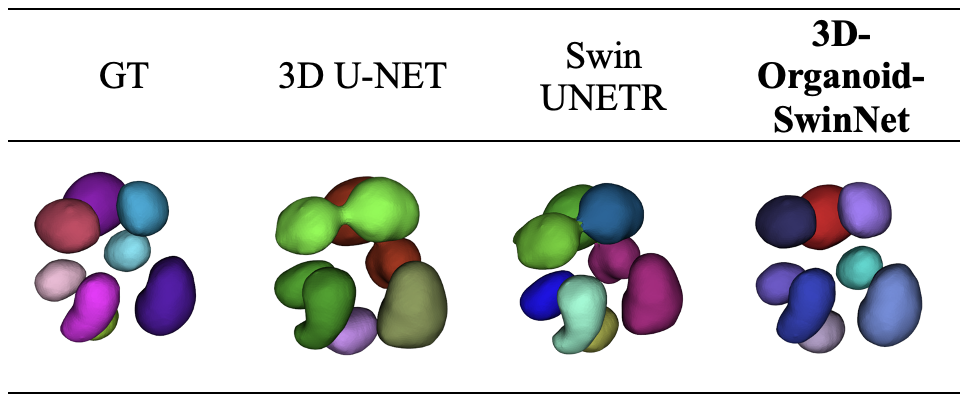
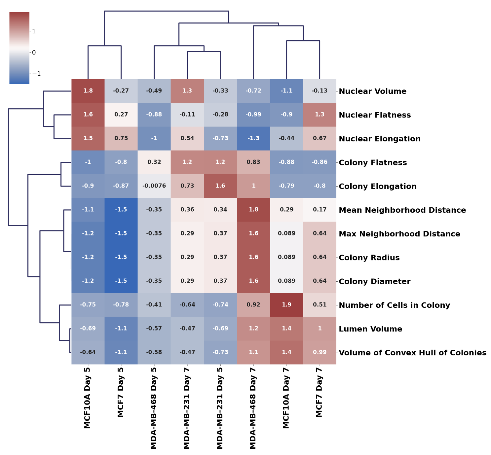

<div align="center">

  <h1>3D-Organoid-SwinNet</h1>
  <p>This repository contains the code for 3D-Organoid-SwinNet model for Segmentation of 3D organoids. In this readme, you will find a description of 3D_Organoid_SwinNet.</p>

</div>

<hr/>

| MCF10A Day 2 | MCF10A Day 5 | MCF10A Day 7 |
|-------|-------|-------|
| <div align="center">[](gif/10a_day2_c.gif)</div> | <div align="center">[](gif/10a_day5_c.gif)</div> | <div align="center">[](gif/10a_day7.gif)</div> |

## Dataset

The data includes organoid cultures fixed on various days and encompasses a broad mutation landscape of breast cancer cell lines, including MCF10A, MCF7, MDA-MB-231, and MDA-MB-468.

### 🗂️ Folder Structure:
Organize your data as follows:

```
data/  
├── imagesTr/  
│   ├── img11.nii.gz  
│   ├── img22.nii.gz  
├── labelsTr/  
│   ├── label11.nii.gz  
│   ├── label22.nii.gz  
├── dataset.json  
```

---

## Model Architecture

The proposed framework includes a Swin Transformer block, 3D convolutional blocks, and Multilayer Perceptron (MLP) blocks. The Swin Transformer block generates features at four different resolution scales. After extracting global features with the Swin Transformer block, the architecture employs five 3D convolutional blocks for local feature extraction. Then, MLP blocks are used to reconstruct the output shape. Finally, an additional 3D convolutional layer with a 1×1 kernel size acts as the model's terminal layer.




## Running the Model
To run the model, follow these steps:

1. **Install Dependencies**: Ensure you have all the required dependencies installed. Navigate to the root directory of the project in your terminal and execute the following command:

    ```
    pip install -r requirements.txt
    ```

    This command will install all the necessary Python packages listed in the `requirements.txt` file.


2.  This repository is built upon the foundational work provided in [Synapse](https://github.com/LeonidAlekseev/Swin-UNETR).

## 🚀 Training

Before training, configure the hyperparameters in the `config.py` file:

#### 🔧 Hyperparameter Configuration
- **`data_dir`**: Specifies the path to the dataset..  
- **`saved_model_dir`**: Location where trained models and checkpoints will be stored.
- **`num_samples`**: Defines the number of samples to be used for training.  
- **`num_classes`**: Total number of target classes, including the background.
- **`input_size`**: Specifies the dimensions of the input images or data.
- **`input_channels`**: Indicates the number of input channels (e.g., 1 for grayscale, 3 for RGB).
- **`feature_size`**: Determines the size of the feature vectors extracted by the model.
- **`use_checkpoint`**: Toggles model checkpointing on or off.  
- **`learning_rate`**: Sets the initial learning rate for optimization.  
- **`weight_decay`**: Configures the L2 regularization penalty rate.
- **`max_iterations`**:  Specifies the maximum number of training iterations.
- **`eval_num`**: Defines how frequently evaluations are performed during training.


## 📊 Results

### Quantitative Results (Microscopic data)
<div align="center">
  
</div>

### Microscopic data Visualization
<div align="center">
  
</div>

### 🧬 Morphogenesis Analysis

**BioProps** is a Python library designed to compute properties of cell nuclei and colonies from NIfTI files, facilitating the analysis of cellular structures in medical images.

📦 **Available on PyPI**: [BioProps](https://pypi.org/project/BioProps/) [Try: pip install BioProps]

<div align="center">
  
  
</div>


## 📣 Citation

If this repository contributes to your research, we kindly request that you cite our paper.

[1] Sohaib M, Shabani S, Mohammed SA, Winkelmaier G, Cheng Q, Parvin B. 3D_Organoid_SwinNet: High-content profiling of 3D organoids through Transformer-Based Architecture. InIEEE-EMBS International Conference on Biomedical and Health Informatics.

